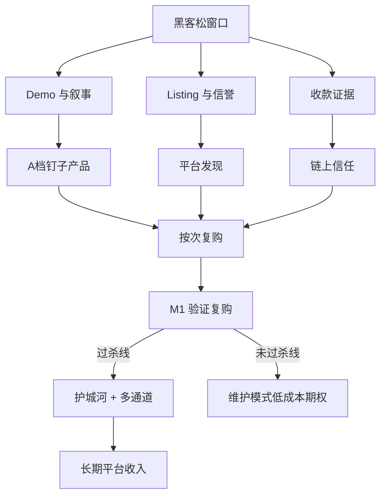

# Agent 服务路线图：黑客松奖项 × 长期赚钱

- 日期：2026-07-24
- 身份：Leo Labs ASP #3977 · api.leolabs.me
- 问题：按 Genesis 细分类别奖项要求，同时服务「长期在 Agent 服务平台上赚钱」，怎么规划？
- 结论一句话：**黑客松是渠道加速器与叙事窗口；赚钱靠「别人愿意付的价值 + 边缘按需履约 + 多平台可迁移收款」。**  
- **2026-07-24 修正**：商业主线不先验锁死「决策闸」；**以有机付费落点锁定**。决策卡只作可演示假设。推进细节见 `2026-07-24-advance-plan-wtp-first.md`。

---

## 0. 两个时钟，不要混成一个计划

| 时钟 | 截止/节奏 | 成功定义 | 资源占比（建议） |
|---|---|---|---:|
| **H · 黑客松** | ~2026-07-27 23:59 UTC | 过审可展示 + ≤90s 可复现 demo + 有机调用证据 + 对齐至少 2 个细分奖 | 70%（本周） |
| **M · 赚钱机器** | 上架后持续；4 周 kill line | 有机付费调用复购 + GMV 可讲 + 成本趋近 0 | 30% 本周 / **之后 100%** |

纪律：

- 本周一切「新 SKU」若不能同时服务 H 奖项叙事 **且** 加深 M 的 A 档钉子 → **不做**。
- 黑客松结束 ≠ 产品结束；H 的产出必须可继承为 M 的资产（listing、收据、demo 片、reputation）。

---

## 1. 细分奖项 → 我们押什么

| 奖项 | 评委大概看什么 | 我们现有弹药 | 本周动作（只做这些） | 长期继承 |
|---|---|---|---|---|
| **金融副驾驶** | 能否当 Agent 的金融决策辅佐 | finance-cockpit · regime · divergence · smart money · upset · pm-trade-preflight · **pm-decision-card** · token-dd | **主叙事**：一张 decision-card / cockpit 演示「买前闸」 | 成为旗舰 SKU 组；加深信号质量 |
| **营收火箭** | 真实收款 / GMV / 增长 | x402 已开；历史有机单；#3977 货架 | **证据包**：有机调用截图/链上结算；**禁止自刷**；过审后尽量有新有机单 | 平台 GMV 份额；跨平台复用同 endpoint |
| **软件实用工具** | 非金融也好用的 Agent 工具 | budget-preflight · delivery-audit · publish-readiness · verify · slop | demo 第二条线：发文/交件闸（90s 内可切） | Agent DevTools 线；平台无关刚需 |
| **社交热议** | 话题、传播、#Okxai | build-in-public · 多场景货架故事 | 一条清晰帖：OPC + 按次付 + 决策卡；带 #Okxai | 内容资产；获客漏斗入口 |

**不主攻**（除非官方新增硬要求）：纯娱乐/纯社交产品、重 UI dApp、需要 7×24 人工值守的服务。

**奖项组合策略（诚实）**：

```
主申：金融副驾驶（产品最贴）
兼报：营收火箭（有收款就冲；没有就别硬吹）
加分：软件实用工具（S1 工具链一条 demo）
保底：社交热议（内容成本低，10×$1K 池）
```

---

## 2. 长期怎么在 Agent 服务平台上赚钱（商业模型）

### 2.1 平台只提供三件事

1. **发现**（货架 / 搜索 / Agent 编排入口）  
2. **收款**（x402 / A2A / 托管结算）  
3. **信誉**（链上成交与评分）

**履约与差异化必须在你自己的边上。**  
我们已选的模型：`Cloudflare Worker 边缘按需 + 规则/公开 API + x402` —— **卖家电脑不必在线、不必 LLM、边际成本≈0**。这是能规模化赚钱的前提。

### 2.2 钱从哪来（优先级）

| 层级 | 收入形态 | 谁付 | 我们该卖什么 |
|---|---|---|---|
| **L1 按次钉子（现在）** | pay-per-call | 其他 Agent / 自动化脚本 | A 档工作流闸（budget / audit / publish / trade-preflight / decision-card / cockpit） |
| **L2 订阅/额度（平台成熟后）** | monthly / credit pack | 高频 Agent 运营方 | 同一组钉子的「月度额度」——**只在平台支持且 L1 已证明复购后做** |
| **L3 数据溢价** | 更高单价 SKU | 研究型 Agent | PolyData 深度信号、校准分、cohort —— **护城河** |
| **L4 多平台套利** | 同核心多上架 | 各平台买家 | 核心逻辑在自己域名；OKX / 其他 Agent 市集只是通道 |

**不靠**：SKU 数量、自买刷单、一次性黑客松奖金（奖金是期权，不是商业模式）。

### 2.3 单位经济（心里要有数）

```
单次收入 ≈ listing 标价（USDT）
单次成本 ≈ CF 请求费 + 上游 API（多数公开免费）+ 0 LLM
毛利 ≈ 极高
瓶颈 ≠ 算力，= 发现与复购
```

因此路线图的核心 KPI 不是「上了多少 SKU」，而是：

1. **有机付费调用 / 周**  
2. **复购率（同一 buyer 或同一 agent 回访）**  
3. **A 档收入占比**（C 档发现 SKU 占比应下降）  
4. **履约失败率**（付费 5xx 直接伤信誉）

---

## 3. 产品路线图（三阶段）

### Phase H（现在 → 提交截止）· 「可演示的赚钱原型」

**目标**：评委 90 秒内看懂「Agent 付费 → 得决策/闸门 → 可复购」。

| 优先级 | 事项 | 完成定义 |
|---|---|---|
| P0 | Listing 过审 / 可演示 | #3977 可公开展示或有审核进度可述 |
| P0 | Demo 脚本固定 | 金融副驾驶：`pm-decision-card` 或 `finance-cockpit`；工具线：`publish-readiness` 或 `delivery-audit` |
| P0 | 收款证据 | 有机 x402 成功单（历史亦可）+ 架构说明「边缘按需」 |
| P1 | 参赛物料 | ≤90s 片 / 帖 / 表单；#Okxai；不写禁词 |
| P1 | A 档文案统一 | listing 强调 `value_loop` / agent_loop，不把 C 档包装成旗舰 |
| P2 | 停止扩 C 档 SKU | 天气/政治/宏观/比赛卡只作发现，不再平行拆 |

**本阶段明确不做**：LLM Agent 常驻、任务厅冷触达主线、Encode Final（除非你另开指令）、自买刷 GMV。

### Phase M1（提交后 2–4 周）· 「复购与杀线」

**目标**：验证是不是真有人愿意反复付钱。

| 动作 | 说明 |
|---|---|
| 只加深 A 档 | decision-card 质量、audit 规则、cockpit 信号、regime/divergence 诚实降级 |
| 观测 KPI | 有机调用/周、A 档占比、失败率 |
| Kill line（继承 OPC 战略） | 约 4 周：若平台无增长且我们有机调用仍极低 → **降维护模式**，停扩货架，保留收款与信誉 |
| 内容 | 里程碑驱动 build-in-public，不日更 |

### Phase M2（平台或调用起来之后）· 「护城河与通道复制」

| 动作 | 说明 |
|---|---|
| PolyData / OSS 加深 | 把独特数据变成更高价 L3 SKU，而不是新薄包装 |
| 订阅/额度 | 仅当平台支持且 L1 复购成立 |
| 多平台上架 | 同一 `api.leolabs.me` 接到其他 Agent 市集 / x402 生态（通道多元化，降低单平台风险） |
| 可选 LLM 产品 | **单独定价含成本**；永不让免费/低价 SKU 吞 LLM 成本 |

---

## 4. 架构路线图（支撑赚钱，而不是炫技）

```
现在（已对齐赚钱）:
  Buyer Agent → OKX 货架 → x402 → api.leolabs.me (CF) → 规则 + 公开 API → JSON

近端加深:
  同上 + 更强 A 档逻辑 + 可选快照缓存（降上游依赖）+ 统一 value_loop 字段

中期（有收入再做）:
  PolyData 预计算任务 → R2/KV 快照 → Worker 只读
  （仍不必 7×24 卖家在线）

慎做:
  强制常驻 Agent 进程才能履约
  每个 SKU 绑一个 LLM
  把履约绑死在单一平台内置 runtime（失去多通道）
```

**原则**：平台可换，**域名上的付费闸与数据逻辑不可换。**

---

## 5. 组织/节奏（一个人 + Agent）

| 频率 | 做什么 |
|---|---|
| 黑客松本周每日 | 过审状态 / demo 一次跑通 / 有机调用是否增加 / 物料是否齐 |
| 每周一（之后） | 调用量 · GMV · A/B/C 占比 · 是否触发 kill line |
| 每两周 | 重读本路线图 + `opc-longterm-strategy`：平台是否还值得加码 |

Hard gates 不变：不自动公开支付、不自买刷量、密钥不进仓库。

---

## 6. 一张图：奖项要求如何喂给长期赚钱



---

## 7. 立即执行清单（按优先级）

1. **冻结 C 档扩 SKU**；资源只进 A 档加深与 demo。  
2. **定死两条 demo 路径**：金融副驾驶（decision-card/cockpit）+ 软件工具（publish/audit）。  
3. **准备营收火箭证据包**（有机单 + x402 + 边缘履约说明）。  
4. **社交帖一条讲透**：OPC · 按次付 · Agent 买前闸 · #Okxai。  
5. **提交后切换 M1**：看复购，不看 SKU 数；4 周杀线严格执行。  
6. **Encode / 任务厅**：非主线；仅监控或你另下指令。

---

## 8. 与旧战略的关系

- 继承 `2026-07-05-opc-longterm-strategy-v1.md` 的 T1–T3 与 kill line。  
- 修正旧组合叙事：不再以「World Cup 单点」为中心，改为 **PM/Crypto/Sports 通用决策闸 + Agent DevTools**。  
- 修正「多服务占位」：占位有用，但 **赚钱靠 A 档密度，不靠 C 档宽度**。

---

## 9. 一句话路线图

> **本周用金融副驾驶 + 工具闸 + 真实收款证据打黑客松；之后用同一套边缘按需 A 档钉子验证复购；过杀线再加深数据护城河并复制到多平台——平台是收银台与橱窗，生意在你自己的 API 上。**
